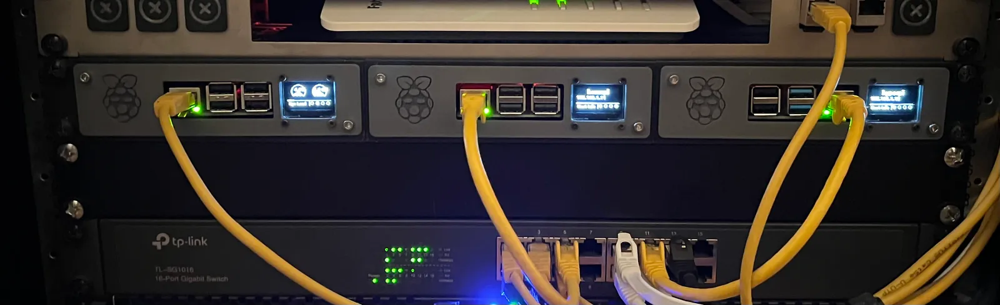
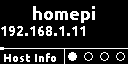
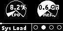
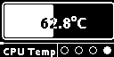

# Raspi-Status-Display

A small utility to run on RaspberryPis and display some general purpose pages with host information. 

Suits up well, with my custom 3D printable RaspberryPi Rack Storage [here](https://www.printables.com/de/model/352578-triple-raspberrypi-rack-mount):

. 

## Output On Display
The generated output will look like this (as of 05/2023):

 

## Sequence
 
 
 

## Installation 
`$> curl -sSL https://raw.githubusercontent.com/KneeNinetySeven/Raspi-Status-Display/main/setup.sh | bash`

## Configuration

Currently supported: SSD1306 compatible with size
WIDTH = 128 
and
HEIGHT = 64
